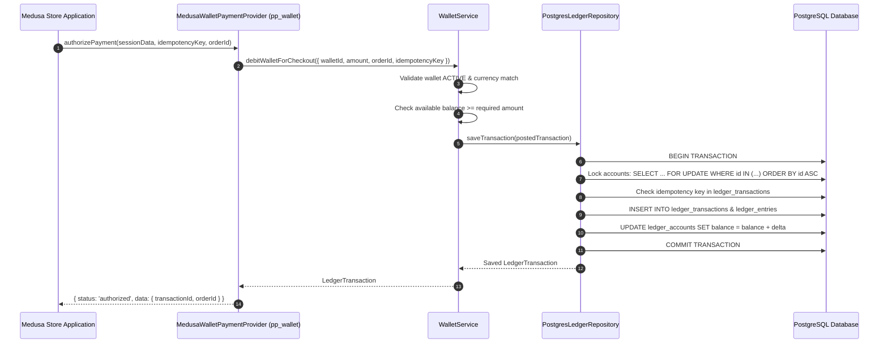

# Wallet Architecture & Design Specification

This document provides the authoritative architectural specification for the Wallet Ecosystem within `payment-platform-monorepo`. It details the component responsibilities, layer isolation boundaries, double-entry financial ledger semantics, state transitions, and Medusa v2 integration architecture.

---

## 1. System Overview & Monorepo Boundaries

The wallet platform provides a framework-agnostic double-entry financial ledger and customer stored-value aggregate system. It is designed to operate as a core component within the monorepo while remaining cleanly consumable by external Medusa v2 applications (such as `depix-ecommerce`).

### Package Responsibilities & Dependency Direction

```text
  Consumer Application (Medusa v2 / depix-ecommerce / Custom App)
                              │
                              ▼
        ┌──────────────────────────────────────────┐
        │       @amirhossein-moloki/wallet-core     │
        │  - Money Value Object (bigint minor)     │
        │  - Wallet & Ledger Domain Entities        │
        │  - WalletService & ReconciliationService │
        │  - Medusa v2 Integration Adapters        │
        │  - Repository Interfaces (Ports)         │
        └─────────────────────┬────────────────────┘
                              │
                              ▼
        ┌──────────────────────────────────────────┐
        │ @amirhossein-moloki/wallet-persistence-  │
        │                 postgres                 │
        │  - PostgresWalletRepository              │
        │  - PostgresLedgerRepository              │
        │  - PostgresReconciliationRepository      │
        │  - DatabaseMigrator & SQL Schema         │
        │  - Transaction & Locking Engine          │
        └─────────────────────┬────────────────────┘
                              │
                              ▼
                    PostgreSQL Database
```

#### Dependency Rules:

1. **`@amirhossein-moloki/wallet-core`** has zero persistence or framework dependencies (except domain errors shared from `@amirhossein-moloki/payment-core`).
2. **`@amirhossein-moloki/wallet-persistence-postgres`** depends on `wallet-core`, `payment-core`, and `pg`.
3. **Consumer Applications** depend on `wallet-core` and `wallet-persistence-postgres`. Persistence is injected into domain services via repository ports (`IWalletRepository`, `ILedgerRepository`).

---

## 2. Layer Isolation & Component Boundaries

### Core Domain Layer (`packages/wallet-core/src/domain`)

- **`Money`**: Immutable value object. Guarantees exact integer arithmetic in currency minor units using `bigint`. Eliminates floating-point inaccuracies.
- **`Wallet`**: Aggregate root representing customer stored value. Manages wallet lifecycle states (`ACTIVE`, `FROZEN`, `CLOSED`).
- **`LedgerAccount`**: Double-entry ledger account (`ASSET`, `LIABILITY`, `EQUITY`, `REVENUE`, `EXPENSE`). Tracks balance formulas and ownership.
- **`LedgerTransaction` & `LedgerEntry`**: Immutable double-entry financial transaction headers and line entries. Enforces balanced debits and credits (`sum(DEBIT) == sum(CREDIT)` per currency).

### Application Service Layer (`packages/wallet-core/src/services`)

- **`WalletService`**: High-level application orchestrator for wallet creation, verified online top-ups, authorized admin credits/debits, and e-commerce checkout debits.
- **`WalletReconciliationService`**: Read-only service for detecting unbalanced posted transactions and stored vs derived balance mismatches.

### Medusa v2 Integration Layer (`packages/wallet-core/src/medusa`)

- **`MedusaWalletModuleService`**: Service container module adapter exposing wallet provisioning, top-ups, and admin operations.
- **`MedusaWalletPaymentProvider`**: Medusa `pp_wallet` payment provider adapter handling checkout payment initiation, authorization, capture, cancellation, and refund.

### Persistence Layer (`packages/wallet-persistence-postgres/src`)

- **`PostgresWalletRepository`**: Stores wallet aggregate entities and manages status updates.
- **`PostgresLedgerRepository`**: Handles transactional ledger posting, deterministic row locking (`SELECT FOR UPDATE ORDER BY id ASC`), exact PostgreSQL `BIGINT` balance updates, and idempotency deduplication.
- **`DatabaseMigrator`**: Manages idempotent execution of SQL migrations (`001_wallet_initial_schema.sql`).

---

## 3. Financial Invariants & Double-Entry Accounting

### Exact Integer Arithmetic (`Money`)

All monetary amounts are represented as integer minor units using Node.js `bigint` (e.g., 100,000 IRR = 100,000 minor units; $10.50 USD = 1,050 minor units). Direct instantiation from floating-point numbers throws `InvalidAmountError`.

### Double-Entry Balancing Rule

Every financial movement requires at least two ledger entries whose debit and credit totals balance exactly:

$$\sum \text{DEBIT} = \sum \text{CREDIT}$$

```text
Transaction: Wallet Top-Up (100,000 IRR)
├── DEBIT  System Cash Clearing Account (Asset +)    : 100,000 IRR
└── CREDIT Customer Wallet Balance Account (Liability +) : 100,000 IRR
```

### Account Balance Formulas

| Account Type  | Debit Effect | Credit Effect | Balance Normal Direction                           |
| :------------ | :----------: | :-----------: | :------------------------------------------------- |
| **ASSET**     | Increase (+) | Decrease (-)  | Balance = $\sum \text{DEBIT} - \sum \text{CREDIT}$ |
| **EXPENSE**   | Increase (+) | Decrease (-)  | Balance = $\sum \text{DEBIT} - \sum \text{CREDIT}$ |
| **LIABILITY** | Decrease (-) | Increase (+)  | Balance = $\sum \text{CREDIT} - \sum \text{DEBIT}$ |
| **EQUITY**    | Decrease (-) | Increase (+)  | Balance = $\sum \text{CREDIT} - \sum \text{DEBIT}$ |
| **REVENUE**   | Decrease (-) | Increase (+)  | Balance = $\sum \text{CREDIT} - \sum \text{DEBIT}$ |

---

## 4. Wallet Lifecycle & State Transitions

```text
          ┌────────────────┐
          │  Provisioning  │
          └───────┬────────┘
                  │ Wallet.create()
                  ▼
          ┌────────────────┐
          │     ACTIVE     │◄────────────┐
          └───────┬────────┘             │
                  │                      │
        freeze()  │                      │ unfreeze()
                  ▼                      │
          ┌────────────────┐             │
          │     FROZEN     │─────────────┘
          └───────┬────────┘
                  │ close()
                  ▼
          ┌────────────────┐
          │     CLOSED     │
          └────────────────┘
```

- **ACTIVE**: Wallet is fully operational. Debits, credits, top-ups, and balance checks are permitted.
- **FROZEN**: Wallet is administrative locked. All transactions throw `InvalidWalletStateError`.
- **CLOSED**: Wallet is permanently terminated. Cannot perform any financial operations or transition out of `CLOSED`.

---

## 5. Sequence Architecture

### E-Commerce Checkout Debit Flow



---

## 6. PostgreSQL Concurrency & Locking Architecture

To prevent deadlocks and race conditions during concurrent financial transactions (e.g. parallel checkout debits or top-ups on the same customer balance), `PostgresLedgerRepository`:

1. **Collects referenced account IDs**: Identifies all ledger account IDs participating in the transaction.
2. **Sorts account IDs deterministically**: Orders IDs in alphabetical ascending order (`ORDER BY id ASC`).
3. **Acquires row-level locks**: Issues a deterministic `SELECT ... FOR UPDATE` before applying updates.
4. **Executes atomic balance mutations**: Updates materialized `ledger_accounts.balance` using minor-unit SQL addition/subtraction inside the database transaction boundary (`withTransaction`).

---

## 7. Medusa v2 Integration Architecture

The Medusa v2 integration consists of two adapters in `@amirhossein-moloki/wallet-core`:

1. **`MedusaWalletPaymentProvider`** (`pp_wallet`):
   - Implements payment provider lifecycle (`initiatePayment`, `authorizePayment`, `capturePayment`, `cancelPayment`, `refundPayment`).
   - Verifies customer wallet ownership against session `customer_id`.
   - Idempotently posts double-entry transactions during payment authorization.

2. **`MedusaWalletModuleService`**:
   - Registered within Medusa's dependency injection container as `WALLET_MODULE`.
   - Exposes wallet provisioning (`getCustomerWallet`), balance lookups (`getWalletBalance`), online top-ups (`topUpWallet`), and administrative adjustments (`adminCreditWallet`, `adminDebitWallet`).
